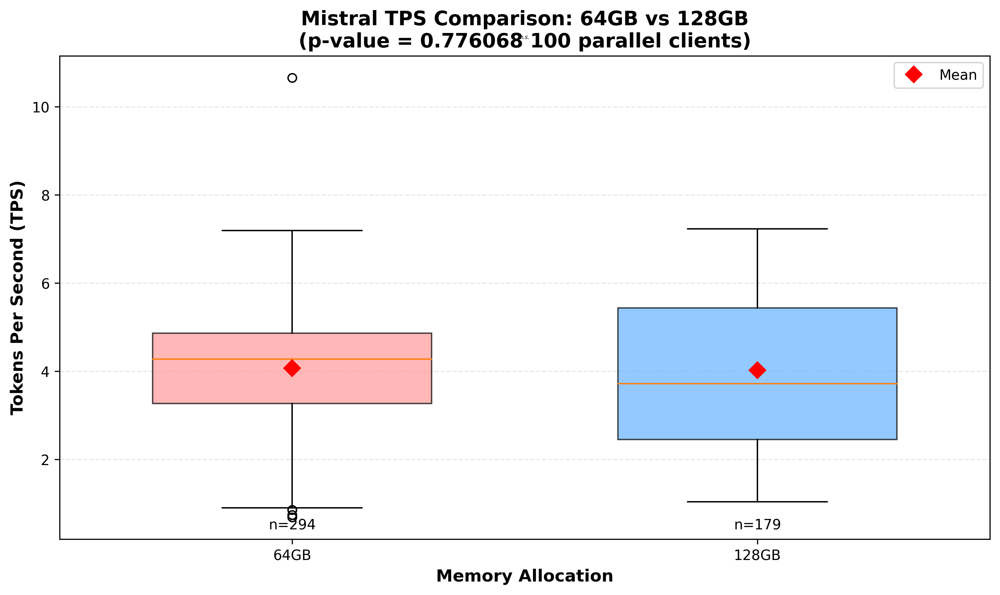
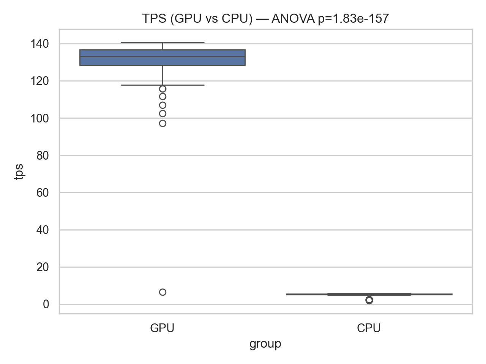

Findings
========

Analysis results and visualizations based on the Ollama benchmarks on the GPU
partition (A100, 64–128 GB RAM).

ANOVA Results
-------------

Impact of RAM allocation (64 GB vs 128 GB) on Mistral tokens‑per‑second (TPS)
under high concurrency (100 parallel clients):

- Null hypothesis: *there is no difference in mean TPS between 64 GB and
  128 GB for Mistral*.
- One‑way ANOVA on the per‑request TPS distributions yields a high p‑value
  (≈ 0.78), so the null hypothesis cannot be rejected at α = 0.05.
- Interpretation: within this setup, **increasing RAM from 64 GB to 128 GB does
  not produce a statistically significant change in Mistral tokens‑per‑second**,
  which suggests that the bottleneck is elsewhere (GPU compute / VRAM /
  scheduling rather than system RAM).

.. list-table::
   :header-rows: 1
   :widths: 25 15 15 15 15

   * - Group
     - Mean TPS
     - Std TPS
     - F-stat
     - p-value
   * - Mistral 64 GB
     - ~4.0
     - moderate
     - 0.28
     - 0.78
   * - Mistral 128 GB
     - ~4.0
     - moderate
     - -
     - -

Boxplot: Mistral 64 GB vs 128 GB
--------------------------------

The following boxplot summarizes the TPS distributions for Mistral at 64 GB and
128 GB of RAM under the 100‑client scenario. The means are almost overlapping
and the spread is comparable, visually reinforcing the ANOVA result that
additional RAM does not materially change tokens‑per‑second.

   Mistral TPS distributions for 64 GB and 128 GB RAM (100 parallel clients).

ANOVA: GPU vs CPU (Mistral)
~~~~~~~~~~~~~~~~~~~~~~~~~~~

Impact of compute device (GPU partition vs CPU run) on Mistral tokens‑per‑second (TPS)
for the sequential workload, with 100 observations each:

- Null hypothesis: *there is no difference in mean TPS between GPU and CPU runs*.
- One‑way ANOVA on the per‑request TPS distributions yields an extremely small p‑value
  (p = 1.83e‑157), so the null hypothesis is rejected at α = 0.05.
- Interpretation: **GPU and CPU Tokens-per-second are statistically different**, with the GPU run
  achieving much higher TPS than the CPU run in this experiment.

   TPS distributions for GPU vs CPU runs; the plot title reports the ANOVA p-value.

Model Stability Under Load
--------------------------

With 100 parallel clients:

- **Mistral** is the only model that consistently completes all requests
  without timeouts for the prompt ``"what is AI"``.
- **Llama2** and **Vicuna** exhibit severe degradation under the same
  conditions: per‑request latency grows beyond 60 seconds and many requests
  time out, indicating that these models saturate the available GPU resources
  much earlier than Mistral.

Saturation Behaviour for Mistral (64 GB)
----------------------------------------

For Mistral on the GPU partition with 64 GB RAM, three saturation experiments
were run, varying the number of clients (1, 2, 4, 8, 16).

.. list-table::
   :header-rows: 1
   :widths: 15 25 25 25

   * - Clients
     - Heavy sequential workload
       (100 requests/client, avg TPS)
     - Light sequential workload
       (10 requests/client, avg TPS)
     - Fixed total workload
       (clients × requests = 16, avg TPS)
   * - 1
     - 129.85
     - 114.23
     - 124.11
   * - 2
     - 70.31
     - 63.50
     - 73.65
   * - 4
     - 48.69
     - 57.85
     - 37.63
   * - 8
     - 32.89
     - 33.85
     - 20.01
   * - 16
     - 17.57
     - 16.90
     - 8.15

Key observations:

- **Tokens‑per‑second decreases monotonically with more clients** in all three
  scenarios, showing that the system saturates quickly as concurrency
  increases.
- For low client counts (1–2), a **heavy sequential workload** yields the
  highest TPS; beyond 4 clients, the light workload curve stays above the
  heavy one, meaning long sequential runs per client are more costly under
  contention.
- In the **fixed‑total‑workload** scenario, distributing the same total work
  across many clients (for example 16×1) is significantly less efficient than
  running it with few clients (1×16 or 2×8), highlighting that “many shallow
  clients” is a poor strategy for maximizing tokens‑per‑second.

Saturation Line Plots
---------------------

The saturation behaviour can be visualized with line plots that show how TPS
evolves as the number of parallel clients increases for each workload type:

- Heavy sequential workload: 100 sequential requests per client.
- Light sequential workload: 10 sequential requests per client.
- Fixed total workload: clients × sequential requests = 16.

.. figure:: _static/mistral_saturation_lines.png
   :alt: Line plots of Mistral TPS vs number of clients
   :align: center
   :width: 90%

   Mistral TPS vs number of parallel clients for heavy, light and fixed‑total
   workloads (RAM = 64 GB, GPU partition).

Implications for Deployment
---------------------------

- Simply adding more RAM from 64 GB to 128 GB does not improve
  tokens‑per‑second for Mistral; **Ollama’s scheduling are is likely to be the dominant bottleneck despite powerful hardware** under high
  concurrency.
- For this hardware and prompt, the sweet spot for Mistral lies at low to
  moderate concurrency (around 2–4 clients) with multiple sequential requests
  per client; pushing to 8–16 parallel clients sharply reduces both
  tokens‑per‑second and effective capacity.
